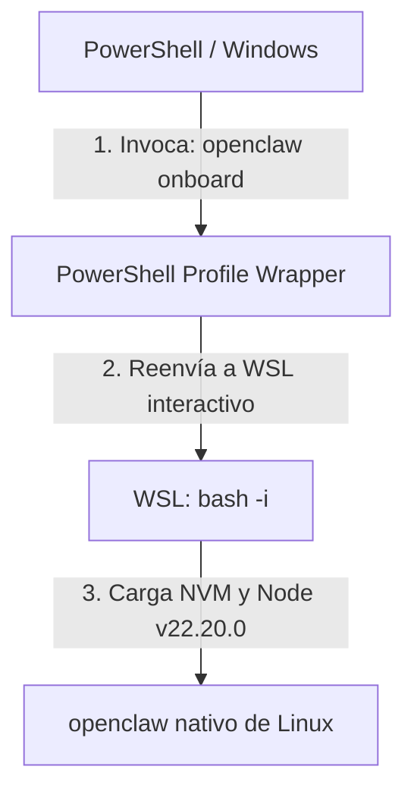

# 🧠 Ollama & SRE Learning Workspace

Bienvenido a tu espacio de trabajo y laboratorio de **Site Reliability Engineering (SRE)** y experimentación de Inteligencia Artificial local con **Ollama**. Este repositorio unifica herramientas de diagnóstico del sistema y configuraciones avanzadas de agentes de IA.

---

## 📂 Estructura del Repositorio

*   **[`disk-analyzer/`](file:///c:/src/learning/ollama/disk-analyzer/)**: Herramientas integradas en Python y PowerShell para analizar el almacenamiento en disco y automatizar la organización de archivos pesados.
*   **[`.gitignore`](file:///c:/src/learning/ollama/.gitignore)**: Reglas de exclusión estándar para evitar la subida de entornos virtuales, cachés de Python, secretos y archivos de sistema de Windows.

---

## 🛠️ Migración e Integración de OpenClaw (Windows ➔ WSL)

Recientemente migramos la configuración del agente **OpenClaw** desde el entorno nativo de Windows (PowerShell) hacia un entorno aislado en **WSL (Windows Subsystem for Linux)**, manteniendo la accesibilidad global desde cualquier consola.

### 📋 Detalles del Diseño Técnico



#### 1. Desinstalación en Windows
Para evitar duplicidades de versión y conflictos con los binarios de Windows Node, se purgó la instalación de PowerShell:
```powershell
npm uninstall -g openclaw
```

#### 2. Instalación en WSL (Ubuntu/Debian)
Para un rendimiento superior de ejecución del agente de IA, se instaló en el entorno nativo de WSL bajo el gestor de versiones **NVM**:
```bash
wsl bash -i -c "npm install -g openclaw@latest"
```
*   **Ruta del binario en WSL**: `/home/mcarvaj/.nvm/versions/node/v22.20.0/bin/openclaw`

#### 3. Función de Integración en PowerShell (`$PROFILE`)
Para invocar de manera fluida el comando sin tener que ingresar a WSL manualmente, se añadió la siguiente función de mapeo al perfil principal de PowerShell (`Microsoft.PowerShell_profile.ps1`):

```powershell
function openclaw {
    wsl bash -i -c "openclaw $(@($args) -join ' ')"
}
```

> [!NOTE]
> **¿Por qué un shell interactivo (`bash -i`)?**
> WSL por defecto abre sesiones no interactivas donde NVM no carga. Utilizar la bandera `-i` obliga a bash a inicializar el entorno completo (cargando `.bashrc`), garantizando que `openclaw` esté siempre visible en el `$PATH` de Linux.

---

## 📊 Herramientas Disponibles

### 💽 Disk Analyzer (`disk-analyzer/`)
Una herramienta diseñada para automatizar la limpieza y orden del almacenamiento local:
1.  **`analizar_disco.py`**: Script en Python para mapear directorios que consumen la mayor cantidad de espacio.
2.  **`analizar_disco.ps1`**: Versión nativa para PowerShell que permite generar reportes rápidos.
3.  **`mover_archivos.ps1`**: Script de automatización de SRE para el archivado seguro y reubicación de ficheros pesados.

---

## ☁️ Integración Avanzada SRE: Ollama Cloud y OpenClaw

### 1. Conexión de Scripts SRE a Ollama Cloud
Para evitar la sobrecarga y congelamiento de la GPU local (Intel UHD 630), se reestructuraron los scripts interactivos en Python (`ollama_mentor.py` y `step_05_ollama_mock_interviewer.py` del repositorio `epam-aws-devops-prep`):

*   **Detección Dinámica de Autenticación**: Los scripts detectan automáticamente la variable de entorno `OLLAMA_API_KEY`.
*   **Conexión en la Nube**: Si la llave existe, se inyecta en el header `Authorization: Bearer` y las peticiones LLM se redirigen al endpoint remoto (`https://ollama.com/api`).
*   **Modelos de Alto Rendimiento**: Uso automático de modelos pesados como `gemma3:27b` y `gemini-3-flash-preview`.
*   **Fallback SRE Automático**: Si el servidor en la nube no responde o hay pérdida de internet, el sistema transiciona sin interrupciones a `http://localhost:11434` utilizando el modelo local `llama3`.

### 2. Soporte Unicode de Windows Console SRE
Se detectaron fallas críticas de codificación (`UnicodeEncodeError`) en la consola estándar de Windows (CP1252) al imprimir Emojis SRE (`🤖`, `☁️`).
*   **Solución Aplicada**: Inyección del hook transversal de reconfiguración estándar en el arranque de la función principal:
    ```python
    import sys
    if hasattr(sys.stdout, "reconfigure"):
        sys.stdout.reconfigure(encoding="utf-8")
    ```

### 3. OpenClaw: Auto-reparación y WSL `systemd`
El Agente de IA `openclaw` fue configurado exitosamente interactuando con el modelo remoto `qwen3-coder:480b-cloud` y conectando a un bot dedicado en **Discord** (`coatl-bot`).
*   **Crestodian DevOps**: Durante la inicialización, el sub-agente `Crestodian` descubrió errores en el Gateway debido a dependencias no soportadas en WSL2 estándar.
*   **Habilitación de SystemD en WSL**: OpenClaw requiere ejecutarse como servicio en Linux (`systemd`). Se inyectó la siguiente directiva dentro de la máquina virtual Ubuntu usando usuario `root`:
    ```ini
    # /etc/wsl.conf
    [boot]
    systemd=true
    ```
*   **Reinicio Rápido**: Se ejecutó `wsl --shutdown` desde PowerShell, permitiendo un arranque nativo de los Daemons de Linux.

### 4. Resolución de Falsos Positivos de UX y Servicios
Tras el reinicio de la infraestructura, se solventaron incidentes relacionados con la experiencia de usuario y el ciclo de vida del servicio:
*   **Registro del Servicio Gateway**: Se detectó que, aunque `systemd` estaba activo, el servicio no estaba registrado. Se ejecutó el comando de aprovisionamiento en WSL:
    ```bash
    openclaw gateway install
    ```
*   **Aclaración de Arquitectura "Local"**: Se resolvió la confusión de UX de OpenClaw, documentando que el estado `local ready` indica la *interfaz de terminal* y **no** el procesamiento de inferencia, confirmando que las operaciones pesadas de razonamiento (*fuzzy planning*) ocurrían exitosamente en la nube con `qwen3-coder:480b-cloud`.
*   **Transición SRE**: Se instruyó la directiva de transición SRE `talk to agent` para cambiar del modo diagnóstico (`Crestodian`) al agente productivo principal.

---

## 🚀 Requisitos Previos

*   **WSL 2** instalado y configurado con tu distribución por defecto.
*   **NVM** y **Node.js** instalados en WSL.
*   **Ollama** ejecutándose localmente para habilitar capacidades LLM locales.
