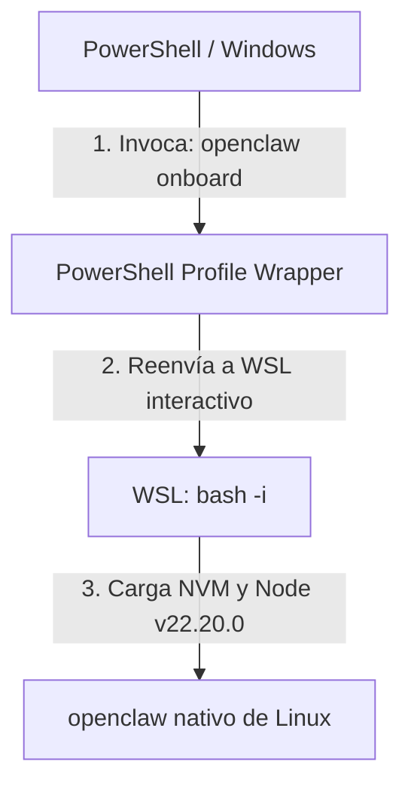

# 🧠 Ollama & SRE Learning Workspace

Bienvenido a tu espacio de trabajo y laboratorio de **Site Reliability Engineering (SRE)** y experimentación de Inteligencia Artificial local con **Ollama**. Este repositorio unifica herramientas de diagnóstico del sistema y configuraciones avanzadas de agentes de IA.

---

## 📂 Estructura del Repositorio

*   **[`disk-analyzer/`](file:///c:/src/learning/ollama/disk-analyzer/)**: Herramientas integradas en Python y PowerShell para analizar el almacenamiento en disco y automatizar la organización de archivos pesados.
*   **[`.gitignore`](file:///c:/src/learning/ollama/.gitignore)**: Reglas de exclusión estándar para evitar la subida de entornos virtuales, cachés de Python, secretos y archivos de sistema de Windows.

---

## 🛠️ Migración e Integración de OpenClaw (Windows ➔ WSL)

Recientemente migramos la configuración del agente **OpenClaw** desde el entorno nativo de Windows (PowerShell) hacia un entorno aislado en **WSL (Windows Subsystem for Linux)**, manteniendo la accesibilidad global desde cualquier consola.

### 📋 Detalles del Diseño Técnico



#### 1. Desinstalación en Windows
Para evitar duplicidades de versión y conflictos con los binarios de Windows Node, se purgó la instalación de PowerShell:
```powershell
npm uninstall -g openclaw
```

#### 2. Instalación en WSL (Ubuntu/Debian)
Para un rendimiento superior de ejecución del agente de IA, se instaló en el entorno nativo de WSL bajo el gestor de versiones **NVM**:
```bash
wsl bash -i -c "npm install -g openclaw@latest"
```
*   **Ruta del binario en WSL**: `/home/mcarvaj/.nvm/versions/node/v22.20.0/bin/openclaw`

#### 3. Función de Integración en PowerShell (`$PROFILE`)
Para invocar de manera fluida el comando sin tener que ingresar a WSL manualmente, se añadió la siguiente función de mapeo al perfil principal de PowerShell (`Microsoft.PowerShell_profile.ps1`):

```powershell
function openclaw {
    wsl bash -i -c "openclaw $(@($args) -join ' ')"
}
```

> [!NOTE]
> **¿Por qué un shell interactivo (`bash -i`)?**
> WSL por defecto abre sesiones no interactivas donde NVM no carga. Utilizar la bandera `-i` obliga a bash a inicializar el entorno completo (cargando `.bashrc`), garantizando que `openclaw` esté siempre visible en el `$PATH` de Linux.

---

## 📊 Herramientas Disponibles

### 💽 Disk Analyzer (`disk-analyzer/`)
Una herramienta diseñada para automatizar la limpieza y orden del almacenamiento local:
1.  **`analizar_disco.py`**: Script en Python para mapear directorios que consumen la mayor cantidad de espacio.
2.  **`analizar_disco.ps1`**: Versión nativa para PowerShell que permite generar reportes rápidos.
3.  **`mover_archivos.ps1`**: Script de automatización de SRE para el archivado seguro y reubicación de ficheros pesados.

---

## 🚀 Requisitos Previos

*   **WSL 2** instalado y configurado con tu distribución por defecto.
*   **NVM** y **Node.js** instalados en WSL.
*   **Ollama** ejecutándose localmente para habilitar capacidades LLM locales.
